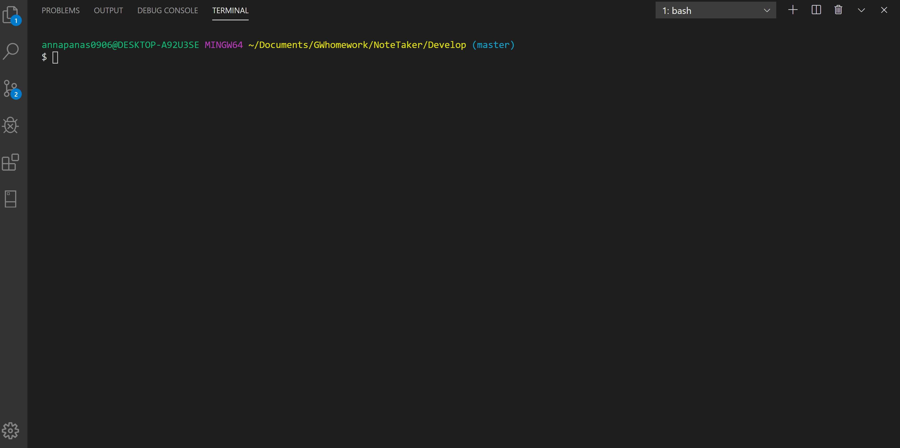

# NoteTaker

Notetaker is an application that helps user write, save and delete notes. This application uses an express backend and save and retrieve note data from a JSON file.

I was given a frontend, so I had to build backend. In order to connect them together I created HTML and API routes. I also created Store.js file to handle reading and writing data using the fs module.

I've been using Express methods: GET, POST and DELETE to handle  the routing.

